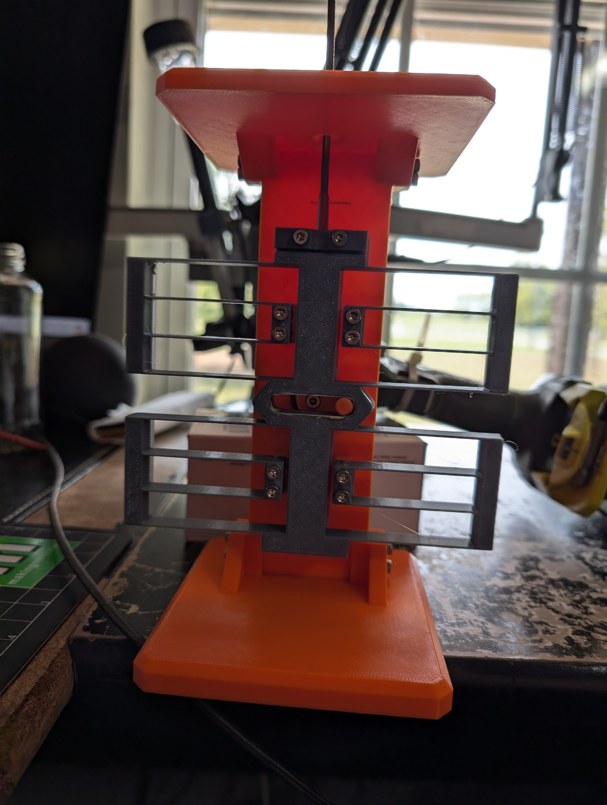
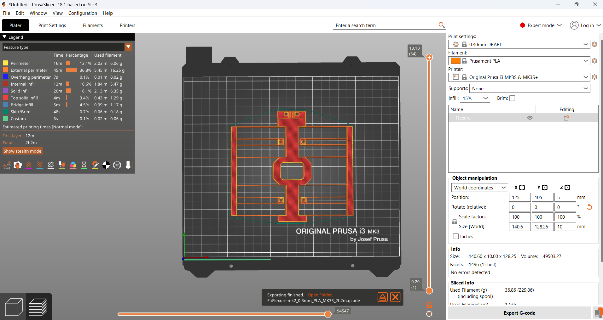

# 3D-Printable-Die-Filer

An open source 3d printable die filer v1.0.1

A die filer is a very old tool that uses an external power source to create reciprocating motion for a file.  This allows material removal that is faster and more controlled than hand filing.  It can remove material similar to Side Milling or Slot Milling in a milling machine.  Additionally, when equipped with square or triangular file, it can file a sharp corner e.g. for keyways or gear teeth.

This is an early release, and while the tool is functional, it is *not* a production quality tool.  It will cut metal.  A demo video in the images folder shows it cutting brass, and I successfully filed a keyway in a steel gear with it.  There is room for improvement, and feedback is welcome, positive or negative via the github issues tracker at <https://github.com/ElizabethGreene/3D-Printable-Die-Filer>

## Danger

 There is a pinch hazard between the bottom of the flexure and the base.  It **hurts**.  Additionally, there are many pinch points for smaller fingers, so it should not be used by or around small children. These should be covered or corrected in future development. While this tool is "only" plastic, it can still cause painful injuries. Safety glasses are highly recommended when using any tool, including this one.

## Features

This was specifically designed to use as few "vitamins", non-printed components,  as possible.  This is accomplished with a compliant mechanism for the linear stage, and using a drill as the power source.  The only hardware required to assemble it are M3 screws, nuts, a washer, and one 608z skate bearing.

## Bill of Materials

* 3D Printed Parts
* M3 Hardware
  * All M3 hardware are standard DIN 912 socket head cap screws.
  * I use this Iexcell M3 screw assortment kit from Amazon. <https://amzn.to/3B85y6H>
  * 4 M3x30mm Socket Head Cap screws - Flexure to Support Mount screws
    * TODO: These can be shorter.
  * 8 M3x14mm Socket Head Cap screws - Base to Support and Worktable to Support Mount screws
  * 1 M3x30mm Socket Head Cap screw - Crankshaft/eccentric reinforcement
  * 2 M3x12mm Socket Head Cap screw for File Clamp
  * 1 M3x5mm Socket Head Cap screw - Bearing Retainer
  * TODO: 2 as-yet unknown length M3x?? screws for tilt table mechanism.
  * 1 M3 washer - Bearing Retainer
  * 1 608z Skate Bearing
  * 8 M3 nuts
* A suitable glue for your filament
  * I used Gorilla SuperGlue
* White Lithium Grease
  * I used "Sta-Lube Multi-Purpose Super White Lithium Grease"
* Files (See Below)

## Files

The file holder is designed to accommodate a variety of different files with shaft diameters from 1/4" to 1/8", down to 2.8mm.

* Harbor Freight "Pittsburgh Needle File Set" or "Central Forge Precision Needle file Set" both work.
* Commercial Die filer files (obsolete and very rare) have a 1/4" round shank and will work.
* Larger files can be made to work by grinding the shank to fit.
* Some files may require enlarging the hole in the work surface

## Assembly

### Reference Photos

Front:

Back:

Crank in Flexure Slot

### Printing

* Print all parts in the orientations shown in the picture below.

  * Note that one side of the C-shaped Circlip has a chamfer.  The flat side should rest on the print bed.
  * The Tilt Table 0.1.3a test model was printed in Hatchbox PLA on a Prusa Mk3S using the Draft 0.3mm preset
    * The Flexure on the original model was printed in Hatchbox PETG and tested extensively (30+ hours)
    * The tilt table's modified flexure in PLA has not been as extensively tested and is considered experimental.

### Step-by-Step Assembly

* Bearing
  * Press the bearing into the support
  * Secure the bearing in the support with a M3x5mm screw and washer
* Crankshaft/Eccentric
  * Place the crankshaft through the bearing, and secure with the circular clip (circlip)
    * Note, the circlip groove is chamfered to enable printing.  The angle in the circlip needs to match this chamfer.
    * A large pair of pliers is helpful installing this clip

    * Drive an M3x30mm screw fully into the crankshaft from the front side
    * This screw reinforces the crankshaft to help prevent failure between layers.
    * This screw slightly expands the shaft, so it needs to be installed *after* the shaft is installed in the bearing.
* Base
  * Attach the base to the support with 4 M3x14mm screws
    * The shortest side of the base faces toward the rear, the side that has the circlip and bearing retainer screw.
* Tilt Table Supports
  * Attach L and R Tilt table supports to vertical support with 2 M3x15 SHCS in each side.  
* Worktop
  * Press two M3 nuts into Worktop underside
  * Place Worktop supports into tilt table support
  * Secure with 2 M3x14mm screws
    * The shortest side of the worktop faces toward the rear, the side that has the circlip and bearing retainer screw.
* File Holder clamp
  * Press in two M3 nuts into the back of the Flexure.  This is a tight fit, and pliers may help.
  * Attach the file holder clamp to the flexure with 2 M3x12mm screws.
  * The file holder clamp is reversible.
    * For large shank files, the concave side should face the flexure.
    * For small shank files, the convex side should face the flexure.
* Flexure
  * Using 4 M3x30mm screws and nuts, attach the flexure to the support.
  * The file holder clamp should facing forward/out so they are easily removable to change files.
  * The crankshaft eccentric should engage the hole in the flexure.
* Lubrication
  * Apply a small dot of grease in the eccentric hole in the flexure.

## Usage

* Install a file.
  * Loosening the File clamp screws.
  * Insert file into the hole.
  * If necessary, flip the file clamp so can grasp securely.
  * Tighten the File Clamp screws.
* Grip the crankshaft with the chuck of a drill.
  * Optional and highly recommended, support the drill so the weight isn't hanging on the crankshaft.
* Optional, clamp the base to a worksurface.
* Using a zip-tie or clamp, turn on the drill.
* Press the work into the moving file.

## Note

 A high pitched chirping sound when cutting is called chatter and generally means you are pressing too hard.

## Changelog

* 0.0.1 alpha - Initial release
* 0.0.2 alpha - Bugfix: Bore and Counterbore in crankshaft missing
* 1.0.1 - Branch: Tilt Table
  * Iterate major version number
    * All printable components (except the Circlip) have been modified and are incompatible with previous release
  * Added tiltable table mechanism
  * Reinforced vertical flexure mechanism to reduce deflection
  * Replaced the fragile glue-together crank-and-pin mechanism with a significantly stronger eccentric cam mechanism
  * Simplified model
    * Removing unneeded washers
    * Combined bearing components
    * Updated model joints for simulation
    * Removed redundant screws in flexure mechanism
  * TODO:
    * Test print
    * Endurance test for PLA flexure
    * Update BOM
    * Make video about making files
    * Update screw lengths for flexure to vertical support
    * Knob for tilt table screws?
    * Update Photos in readme
      * Front
      * Back
      * Circlip
      * Flexure
      * ~~Print Orientations~~

## Problems/disadvantages and Opportunities for future work

* There are pinch hazards as mentioned in the Danger section.
* The flexure is insufficiently stiff against off-axis forces. Machine filing uses low tool pressure, so it's still usable, but I'd like it to be stiffer.
* The base and worktable can flex under heavy workpieces.
* Supporting the drill works, but is dodgy. A better way to mount that is critical.
* A zip-tie to hold down the drill trigger works, but is dodgy. A clamp would be a better solution.
  * Forking the design to use a dedicated motor merits consideration
* Increase the overall stroke length from 25mm to 35-40
* Adapt an adjustable stroke length mechanism ex: <https://youtube.com/shorts/UjDqezJ2Gh0?si=csQhwm905_5Tf_nh>
* ~~Increase the flexure linear throw~~ and consider pre-stressing at assembly to reduce the inherent stiffness at the center position.
* Add an overarm support
  * A good overarm support would allow the unit to be used as a scroll saw, an extremely useful tool.
  * A good overarm support would also allow using it as a power hacksaw for thinner stock
* Add work hold-downs
* Consider forking and stretching the design for a big power hacksaw
* ~~Edit this documentation to include pictures.~~
* ~~A tilting worktable would be nice.~~
